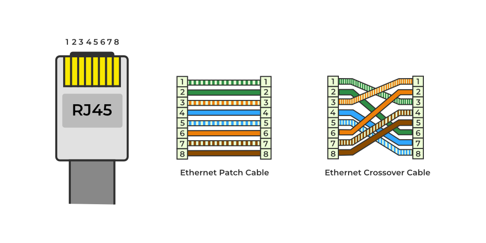
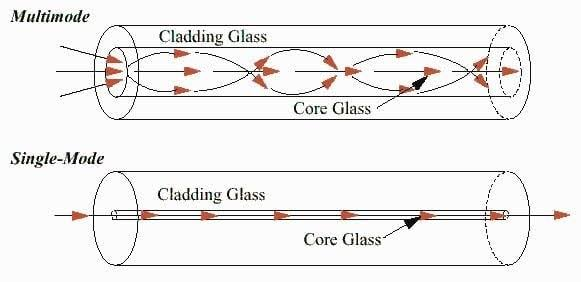

# Networking

## How the internet works
-   By connecting computers to routers, then routers to routers, we are able to
    scale infinitely.
-   Your Home network -> Modem (connection to telephone infrastructure) -> ISP 
    -> Other network
-   An ISP is a company that manages some special routers that are all linked
    together and can also access other ISPs' routers

## HTTP
-   Response [codes](https://datatracker.ietf.org/doc/html/rfc7231#section-6)
    -   1xx : Informational
    -   2xx : Successful
    -   3xx : Redirection
        -   301 : Moved permanently
        -   307 : Moved temporarily
    -   4xx : Client error
        -   410 : Gone
    -   5xx : Server error
    -   HTTP status codes have consequences on caching, and handling of URIs on the client side
-   Methods
    -   GET
    -   POST
    -   PUT
    -   DELETE
    -   HEAD
    -   OPTIONS
    -   TRACE
    -   CONNECT
## Network Devices
-   Repeaters
-   Hub - multi-port repeaters
-   Bridge - only 2 ports; learns devices on each side
-   Switch - faciliates communication *within* a network
    -   3 actions: Learn, Flood, Forward
    -   Maintain Port No. to MAC mapping
    -   Broadcast is a type of *frame* in which the L2 header contains FF:FF:FF:FF:FF:FF as the destination MAC; Flooding is the action of duplicating and forwarding the frame to all hosts on the switch's network.
    -   Switch has both IP and MAC
        -  A switch sends a broadcast frame only if traffic is going *to* or *from* (**NOT** *through*) it, (i.e.), if the switch itself is a host (eg: logging into the switch for configuring it, etc.)
-   Router - faciliates communication *between* networks
    -   Has IP (gateway address) (and MAC?) associated at every interface

## OSI 
-   Segment (TCP header + data) -> Packet (Segment + IP) -> Frame (Packet + MAC) - each of these can be generically referred to as Protocol Data Units (PDUs)

## Address Resolution Protocol (ARP)
- Maps IP to MAC: An ARP table only maps IP addresses to MAC addresses if both devices belong to the exact same local subnet
- This logic is at the Kernal-level : NIC simply looks at the EtherType header (which is x806 for ARP) and forwards it to the Kernal; NIC faciliates the reverse-communication as well
- TODO: ARP fields in PDU
- Host A wants to send a request to Host C residing on a different network
  - Layer 3: OS determines whether the destination-IP is on the same or different network and passes that info to layer 2 (internal call in the OS's network stack)
  - Layer 2: 
    - Same network
      - Check ARP-cache for destination-IP
      - No ARP-entry? Send ARP request for destination-IP; Else encapsulate packet with MAC of destination-IP
    - Different network
      - Check ARP-cache for default-gateway IP
      - No ARP-entry? Send ARP request for default-gateway IP; Else encapsulate packet with MAC of gateway-IP

## Transport Layer
-   Addressing scheme: Ports
    -   Clients select random port to establish connection 
        (response traffic arrives on this port);
        server listens to specific port (client makes request to this specific port);
    -   0-65535 ($2^{16} = 65536$)
### 12 Steps
1. Validation of information sending and receival is done via sequence (SEQ) and acknowlegment (ACK) numbers
2. SEQ and ACK numbers are byte-level information entities
3. Transmission timeout
4. Delayed acknowlegment
5. Window size

## Subnetting
-   [Reference](http://subnetipv4.com/)

## Misc
- Hosts: Client + Server
- Client: Picks a random port for connection
- Server: Pre-defined port on which the application is run
- Routers and switches (managed switches) have NOS (Network Operating System); unmanaged-switches run on ASIC (Application Specific Integrated Circuit)
- The need for 2 different addresses - IP and MAC exists because IP is concerned with the FINAL destination ("End to End" delivery) whereas MAC is concerned with the next step in the journey to reach the final destination

## Cisco Packet Tracer
- RJ-45 (ports) (RJ => Registered Jack) is the technical name for the physical socket used for connecting ethernet-cables. There are 8 ports in total
- FastEthernet: The improved "Ethernet" protocol in which only 4 out of 8 pins are used for sending and receiving info
  - Pins 1 and 2 are for transmitting
  - Pins 3 and 6 are for receiving

- Straight-through vs. cross-over Cu wires
  - The former connects each "pin number" on the source-port with the exact pin number on the destination port; in the latter, pins 1 and 2 of the source are connected to pins 3 and 6 of the destination and vice-versa 
  - Use straight-through to connect an end-devices with a switch
  - Use cross-over to directly connect 2 end-devices
- NIC (Network Interface Card): A chip responsible of converting digital data into electricity (wired card) or radio-waves (wireless card)
  - TODO: How do they internally work?
- ICMP: Internet Control Message Protocol
- IOS
- NM: Network Module
  - `[C|F][E|FE|GE]-[SM]`: `[Copper|Fibre][Ethernet|FastEthernet|Gigabit Ethernet]-[Single Mode]`
  - Slot or card?
  - SM: Single mode (straight path of light) vs. multi mode (zig-zig)
  
- Slot vs. port in switch: Eg. FastEthernet 0/1 (Slot 0, Port 1); a slot is an enclosure in which one or more ports can be filled in
  - TODO: Refine the definition of slot based on motherboard
- Switches vs. Routers
  - The former faciliates communication within networks (192.128.10.x) whereas routers between networks
  - Routers have multiple interfaces => each interface has an IP (and a MAC) that belongs to the subnet it "interfaces" with; this IP is called the "gateway" of that subnet
- CSMA with collision detection (when multiple hosts send packets at the same time to a hub), half-duplex, ...

## IOS commands
- `arp -a`; `arp -d`
- `Switch#show interface status`
- `Switch#show mac address-table`
- User-mode indicator: `Switch>`
- Priviledged mode indicator: (Type exit or Ctrl+C) `Switch#`
- Config mode: From privileged-mode, type `configure terminal` &rarr; `Switch (config)>`
  - To access config of a specific-interface (`config-if`), type `interface FastEthernet 5/1`

## VLANs
- Switches are not that simple!
- Typical mechanism: Learn, Flood, Forward (Switches learn port-to-IP-mappings on the go)
- To prevent "broadcast flooding" (during ARP / during the switch's learning-phase), isolate traffic by creating VLANs => Virtual Local Area Networks
- Creating VLANs => designate a set of ports for each LAN
- VLANs are designed so that the message of a host connected to a port designated to be part of VLAN `x` in the switch, is only broadcasted to other ports belonging to VLAN `x` + the "trunk" port if it is configured to allow VLAN `x`
- An "access-ports" only allows frames whose VLAN is the same as itself; trunk-ports allow frames from multiple VLANs (whether "multiple" equals to "all" or not depends on the configuration)
- Trunk-ports add "tagging" info
- Default VLAN in a switch: VLAN 1

## Proxies
-   Forward
-   Reverse

## CDN

## VPN
-   Site-to-site (IPSec)
-   Remote access (TLS)
-   [VPN vs. TLS](https://security.stackexchange.com/questions/1476/what-is-the-difference-in-security-between-a-vpn-and-a-ssl-connection)

## Doubts
-   Intranet example
-   Payload vs. traffic
-   NIC and Wifi-Access-Cards
-   Routers have MAC?
-   VLAN
-   URL vs. URI
-   CDN
-   Browser caching
-   Bridge vs. Router
-   Firewall
-   Switches
    -   MAC address table should include MAC to Port mapping? (or Port to MAC mapping?)
    -   When a switch floods a network, does it add its own MAC?
-   If I start, say a Hapi server, can other devices connected to the internet
    access it?
### 2026
- What happens if there were only MACs or only IPs?
- Why does each router-interface need a different MAC?
- NTP, SNMP

## References
-   MDN Documentation
